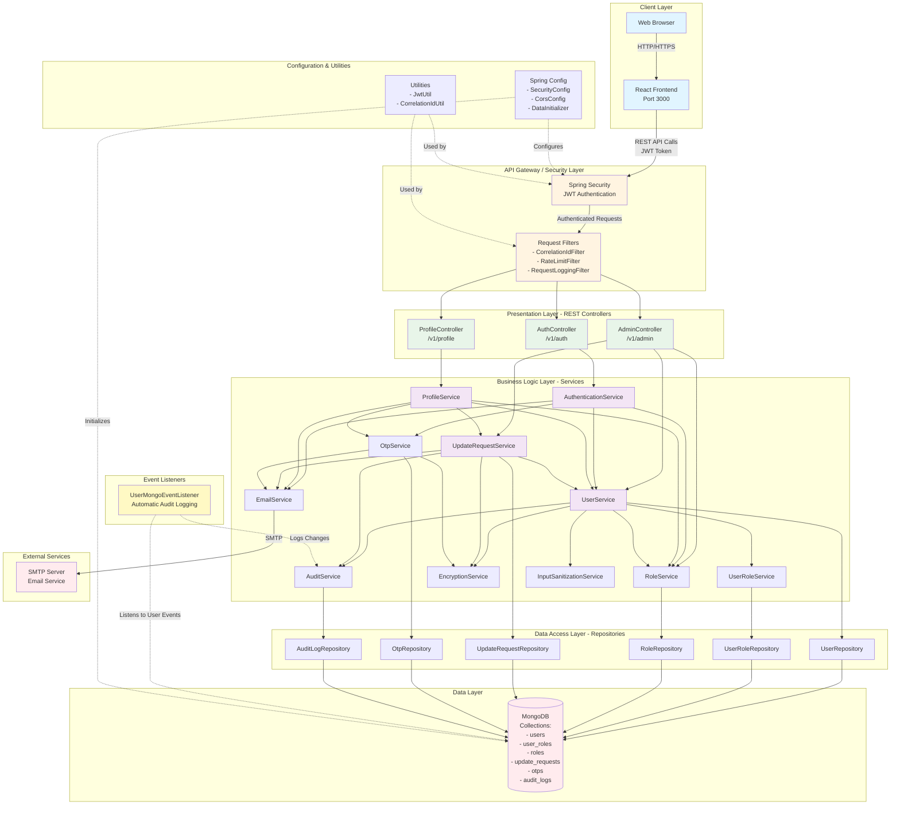

# Kitchensink Application - High-Level Architecture

## System Overview

This document provides a high-level architectural overview of the Kitchensink User Management System, a full-stack application built with React frontend and Spring Boot backend.

## Architecture Diagram



## Component Descriptions

### Frontend Layer

**React Application (Port 3000)**
- **Components:**
  - `Login.js` - User authentication UI
  - `MyProfile.js` - User's own profile management
  - `Profile.js` - View/edit user profiles (admin & self)
  - `AdminDashboard.js` - Admin user management panel
- **Services:**
  - `authApi.js` - API client for backend communication
- **Features:**
  - JWT token stored in localStorage
  - Batch field updates
  - Update request management
  - Real-time validation feedback

### Security Layer

**Spring Security with JWT**
- JWT-based stateless authentication
- Role-based access control (ADMIN, USER)
- Method-level security with `@PreAuthorize`
- CORS configuration for frontend integration

**Request Filters**
- `CorrelationIdFilter` - Request tracking
- `RateLimitFilter` - API rate limiting
- `RequestLoggingFilter` - Request/response logging

### Presentation Layer (Controllers)

**AuthController** (`/v1/auth`)
- `POST /login/request-otp` - Request login OTP
- `POST /login/verify` - Verify OTP and login

**ProfileController** (`/v1/profile`)
- `GET /{userId}` - Get user profile
- `PUT /{userId}` - Batch update profile fields
- `POST /{userId}/email/request-otp` - Request email change OTP
- `GET /{userId}/update-requests` - Get user's update requests
- `DELETE /{userId}/update-requests/{requestId}` - Revoke update request

**AdminController** (`/v1/admin`)
- `GET /users` - List all users (excluding admins)
- `GET /users/search` - Search users
- `POST /users` - Create new user
- `PUT /users/{userId}` - Update user
- `DELETE /users/{userId}` - Delete user
- `GET /update-requests/pending` - Get pending update requests
- `POST /update-requests/{requestId}/approve` - Approve update request
- `POST /update-requests/{requestId}/reject` - Reject update request

### Business Logic Layer (Services)

**AuthenticationService**
- Handles OTP-based login flow
- JWT token generation
- User authentication

**ProfileService**
- Profile retrieval and updates
- Batch field updates
- Email change with OTP verification
- Update request management

**UserService**
- User CRUD operations
- PII encryption/decryption
- Input sanitization
- Admin filtering

**UpdateRequestService**
- Create update requests
- Approve/reject requests
- Revoke requests
- Field value encryption

**RoleService & UserRoleService**
- Role management
- User-role mapping
- Role-based authorization checks

**OtpService**
- OTP generation and verification
- Rate limiting (1000 attempts per 15 minutes)
- OTP expiration management

**EmailService**
- Email notifications
- OTP delivery
- Update request notifications
- User change confirmations

**EncryptionService**
- PII encryption/decryption (email, phone)
- Hash generation for OTPs

**AuditService**
- Audit log creation
- Change tracking
- User activity logging

**InputSanitizationService**
- XSS prevention
- Input validation

### Data Access Layer (Repositories)

Spring Data MongoDB repositories providing:
- CRUD operations
- Custom query methods
- Pagination support

### Data Layer

**MongoDB Collections:**
- `users` - User profiles with encrypted PII
- `user_roles` - User-role mappings
- `roles` - Role definitions (ADMIN, USER)
- `update_requests` - Profile update requests
- `otps` - OTP records with hashed values
- `audit_logs` - Audit trail of all changes

### Event Listeners

**UserMongoEventListener**
- Automatic audit logging on User entity changes
- Tracks create, update, delete operations
- Captures field-level changes

### External Services

**SMTP Server**
- Email delivery for:
  - OTP codes
  - Update request notifications
  - User change confirmations

## Data Flow Examples

### User Login Flow
```
Browser → React → AuthController → AuthenticationService 
→ OtpService → EmailService → SMTP
→ UserService → UserRepository → MongoDB
→ JWT Token → React (stored in localStorage)
```

### Profile Update Flow (Regular User)
```
Browser → React → ProfileController → ProfileService 
→ UpdateRequestService → UpdateRequestRepository → MongoDB
→ EmailService → SMTP (notify admin)
→ Response → React
```

### Profile Update Flow (Admin)
```
Browser → React → ProfileController → ProfileService 
→ UserService → UserRepository → MongoDB
→ UserMongoEventListener → AuditService → AuditLogRepository → MongoDB
→ EmailService → SMTP (notify user)
→ Response → React
```

### Update Request Approval Flow
```
Browser → React → AdminController → UpdateRequestService 
→ UserService → UserRepository → MongoDB
→ UserMongoEventListener → AuditService → AuditLogRepository → MongoDB
→ EmailService → SMTP (notify user)
→ Response → React
```

## Security Features

1. **Authentication:**
   - OTP-based login (no password storage)
   - JWT tokens for session management
   - Token stored in localStorage (frontend)

2. **Authorization:**
   - Role-based access control (RBAC)
   - Method-level security annotations
   - Admin-only endpoints protection

3. **Data Protection:**
   - PII encryption (email, phone numbers)
   - OTP hashing
   - Input sanitization (XSS prevention)

4. **Rate Limiting:**
   - OTP request rate limiting
   - API endpoint rate limiting

5. **Audit Trail:**
   - Comprehensive audit logging
   - Automatic change tracking
   - Field-level change history

## Technology Stack

### Backend
- **Framework:** Spring Boot 3.5.7
- **Database:** MongoDB 8.0+
- **Security:** Spring Security + JWT
- **Documentation:** Swagger/OpenAPI
- **Encryption:** Jasypt
- **Email:** Spring Mail (SMTP)

### Frontend
- **Framework:** React 18
- **HTTP Client:** Axios
- **Routing:** React Router DOM
- **State Management:** React Hooks (useState, useEffect)

### Infrastructure
- **Build Tool:** Maven (Backend), npm (Frontend)
- **Container:** MongoDB
- **Ports:** 8081 (Backend), 3000 (Frontend)

## Key Design Patterns

1. **Layered Architecture:** Clear separation of concerns (Controller → Service → Repository)
2. **DTO Pattern:** Data Transfer Objects for API requests/responses
3. **Repository Pattern:** Data access abstraction
4. **Service Layer Pattern:** Business logic encapsulation
5. **Event-Driven:** MongoDB event listeners for automatic auditing
6. **Strategy Pattern:** Different update flows for admin vs. regular users

## Scalability Considerations

- Stateless authentication (JWT) enables horizontal scaling
- MongoDB sharding support for large datasets
- Async email processing
- Caching layer ready (Caffeine Cache configured)
- Rate limiting prevents abuse
- Pagination for large result sets

