# Backend Request Flow Diagram

This diagram shows the complete backend flow with security, caching, and auditing points clearly marked.

## Backend Request Flow

```mermaid
flowchart TD
    Start([HTTP Request<br/>from Frontend]) --> CorrFilter[1. CorrelationIdFilter<br/>📝 Adds Correlation ID]
    
    CorrFilter --> RateFilter[2. RateLimitFilter<br/>🔒 Rate Limiting<br/>60 req/min per IP]
    
    RateFilter -->|Rate Limit Exceeded| RateLimitError[❌ 429 Too Many Requests]
    RateFilter -->|Allowed| JWTFilter[3. JwtAuthenticationFilter<br/>🔐 JWT Token Validation<br/>Extracts User & Roles]
    
    JWTFilter -->|Invalid Token| AuthError[❌ 401 Unauthorized]
    JWTFilter -->|Valid Token| SecurityCheck[4. Spring Security<br/>🔒 @PreAuthorize Check<br/>Role-based Authorization]
    
    SecurityCheck -->|Not Authorized| AuthzError[❌ 403 Forbidden]
    SecurityCheck -->|Authorized| Controller[5. Controller Layer<br/>AuthController<br/>ProfileController<br/>AdminController]
    
    Controller --> Service[6. Service Layer<br/>Business Logic]
    
    Service -->|Check Cache| Cache{💾 Cache Check<br/>Caffeine Cache<br/>members/memberById}
    
    Cache -->|Cache Hit| CacheResponse[✅ Return Cached Data]
    Cache -->|Cache Miss| Repo[7. Repository Layer<br/>Spring Data MongoDB]
    
    Repo --> MongoDB[(8. MongoDB Database<br/>Collections:<br/>users, roles, user_roles<br/>update_requests, otps<br/>audit_logs)]
    
    MongoDB -->|Data Retrieved| EventListener[9. UserMongoEventListener<br/>📋 Automatic Auditing<br/>Listens to User Events]
    
    EventListener -->|User Created/Updated/Deleted| AuditService[10. AuditService<br/>📋 Creates Audit Log]
    
    AuditService --> AuditRepo[AuditLogRepository]
    AuditRepo --> MongoDB
    
    MongoDB -->|Return Data| Service
    
    Service -->|Async Email| EmailService[11. EmailService<br/>📧 Async Email Sending<br/>OTP, Notifications]
    
    EmailService --> SMTP[SMTP Server]
    
    Service -->|Update Cache| CacheUpdate[💾 Update Cache<br/>Store in Caffeine]
    
    Service --> Response[12. Response<br/>DTO + Correlation ID]
    
    Response --> End([HTTP Response<br/>to Frontend])
    
    CacheResponse --> Response
    
    style CorrFilter fill:#e3f2fd
    style RateFilter fill:#ffebee
    style JWTFilter fill:#ffebee
    style SecurityCheck fill:#ffebee
    style Cache fill:#fff9c4
    style CacheUpdate fill:#fff9c4
    style CacheResponse fill:#fff9c4
    style EventListener fill:#e8f5e9
    style AuditService fill:#e8f5e9
    style EmailService fill:#f3e5f5
    style RateLimitError fill:#ffcdd2
    style AuthError fill:#ffcdd2
    style AuthzError fill:#ffcdd2
```



## Flow Explanation

### 🔒 Security Points (Red)

1. **RateLimitFilter** (Order 2)
   - **When:** Every request (except actuator/swagger)
   - **What:** Limits requests to 60 per minute per IP
   - **Action:** Returns 429 if exceeded

2. **JwtAuthenticationFilter**
   - **When:** Every authenticated request
   - **What:** Validates JWT token from Authorization header
   - **Action:** Extracts user ID and roles, sets SecurityContext

3. **Spring Security @PreAuthorize**
   - **When:** Before controller method execution
   - **What:** Checks role-based permissions
   - **Examples:**
     - `@PreAuthorize("hasRole('ADMIN')")` - Admin only
     - `@PreAuthorize("hasRole('ADMIN') or authentication.name == #userId")` - Admin or own profile

### 💾 Caching Points (Yellow)

**Caffeine Cache** (ACTIVE - Currently Implemented)
- **Cache Names:** 
  - `userById` - User objects by ID (1000 entries, 5 min write, 2 min access)
  - `roleById` - Role objects by ID (100 entries, 30 min write, 10 min access)
  - `roleNameByUserId` - Role names by user ID (1000 entries, 5 min write, 2 min access)
- **Cached APIs:**
  - ✅ `GET /v1/profile/{userId}` - Profile retrieval (100% cache hit after first access)
  - ✅ Role lookups - `getRoleById()`, `getRoleNameByUserId()` (100% cache hit)
  - ⚠️ `GET /v1/admin/users` - Pagination (indirect benefit via user cache)
  - ⚠️ `GET /v1/admin/users/search` - Search (indirect benefit via user cache)
- **Cache Eviction:** Automatic on user create/update/delete, role changes
- **Where:** Between Service and Repository layers

### 📋 Auditing Points (Green)

1. **UserMongoEventListener**
   - **When:** Automatically triggered on User entity events
   - **Events:**
     - `BeforeConvertEvent` - Before save (captures old state)
     - `AfterSaveEvent` - After save (logs create/update)
     - `AfterDeleteEvent` - After delete
   - **What:** Compares old vs new values, captures field changes

2. **AuditService**
   - **When:** Called by EventListener or directly from services
   - **What:** Creates detailed audit logs with:
     - Changed fields
     - Old values
     - New values
     - Performed by (user ID)
     - Timestamp

3. **Manual Audit Logging**
   - **When:** Explicitly called in services
   - **Examples:**
     - `UpdateRequestService.approveRequest()` - Logs approval
     - `UpdateRequestService.rejectRequest()` - Logs rejection
     - `UpdateRequestService.revokeRequest()` - Logs revocation

### 📧 Email Service (Purple)

**EmailService** (Async)
- **When:** Triggered by services
- **What:** Sends emails for:
  - OTP codes (login, email change)
  - Update request notifications (to admin)
  - Update request approval/rejection (to user)
  - User change confirmations
- **How:** Async processing via `@Async` annotation

## Detailed Flow Example: User Profile Update

```
1. Request arrives
   ↓
2. CorrelationIdFilter → Adds X-Correlation-ID header
   ↓
3. RateLimitFilter → Checks IP rate limit (60/min)
   ↓
4. JwtAuthenticationFilter → Validates JWT, extracts user/roles
   ↓
5. Spring Security → Checks @PreAuthorize("hasRole('ADMIN') or authentication.name == #userId")
   ↓
6. ProfileController.updateFields() → Receives request
   ↓
7. ProfileService.updateFields() → Business logic
   ↓
8. UserService.updateUser() → Updates user
   ↓
9. UserRepository.save() → Saves to MongoDB
   ↓
10. UserMongoEventListener.onAfterSave() → Triggered automatically
    ↓
11. AuditService.logUserUpdated() → Creates audit log
    ↓
12. AuditLogRepository.save() → Saves audit log to MongoDB
    ↓
13. EmailService.sendEmailChangeConfirmation() → Async email (if email changed)
    ↓
14. Response returned with updated user data
```

## Security Flow Details

### Authentication Flow
```
Request with JWT Token
  ↓
JwtAuthenticationFilter extracts token
  ↓
Validates signature & expiration
  ↓
Extracts user ID and roles
  ↓
Sets SecurityContext with Authentication object
  ↓
Request proceeds to controller
```

### Authorization Flow
```
Controller method with @PreAuthorize
  ↓
Spring Security evaluates SpEL expression
  ↓
Checks user roles from SecurityContext
  ↓
If authorized → Method executes
If not authorized → 403 Forbidden
```

## Caching Strategy (ACTIVE)

**Cache Configuration:**
- **Type:** Caffeine (in-memory)
- **Caches:**
  - `userById` - Individual user by ID (1000 entries, 5 min write, 2 min access)
  - `roleById` - Individual role by ID (100 entries, 30 min write, 10 min access)
  - `roleNameByUserId` - Role name by user ID (1000 entries, 5 min write, 2 min access)

**Implemented Caching:**
- ✅ `UserService.getUserById()` - `@Cacheable`
- ✅ `UserService.createUser()` - `@CachePut` (caches new user)
- ✅ `UserService.updateUser()` - `@CacheEvict` (removes from cache)
- ✅ `UserService.deleteUser()` - `@CacheEvict` (removes from cache)
- ✅ `UserService.updateUserPhoneNumber()` - `@CacheEvict`
- ✅ `UserService.updateUserEmail()` - `@CacheEvict`
- ✅ `UserService.updateLastLoginDate()` - `@CacheEvict`
- ✅ `RoleService.getRoleById()` - `@Cacheable`
- ✅ `RoleService.getRoleNameByUserId()` - `@Cacheable`

**Why Pagination/Search Not Directly Cached:**
- Pagination: Each page request is unique (page number, size, sort) = too many cache entries
- Search: Infinite possible search terms = unbounded cache growth
- **Solution:** Cache individual users instead. When pagination/search returns results, users already in cache won't need DB lookup.

## Auditing Strategy

**Automatic Auditing:**
- Triggered by MongoDB event listeners
- No code changes needed in services
- Captures all User entity changes automatically

**Manual Auditing:**
- For non-entity operations (e.g., update request approval)
- Explicitly called in service methods
- Provides detailed change tracking

**Audit Log Structure:**
```json
{
  "entityType": "User",
  "entityId": "user123",
  "action": "UPDATE",
  "changedFields": ["email", "phoneNumber"],
  "oldValues": {"email": "old@example.com", "phoneNumber": "1234567890"},
  "newValues": {"email": "new@example.com", "phoneNumber": "9876543210"},
  "performedBy": "admin123",
  "timestamp": "2024-01-15T10:30:00"
}
```

## Error Handling Flow

```
Any Exception in Flow
  ↓
GlobalExceptionHandler catches it
  ↓
Maps to appropriate HTTP status
  ↓
Returns Response DTO with error details
  ↓
Correlation ID included in response
```

## Key Points

1. **Security is layered:**
   - Rate limiting (first line of defense)
   - JWT authentication (identity verification)
   - Authorization (permission checking)

2. **Caching is optional:**
   - Configured and ready
   - Can be enabled with `@Cacheable` annotations
   - Reduces database load for frequently accessed data

3. **Auditing is automatic:**
   - No manual intervention needed for entity changes
   - Event-driven architecture
   - Comprehensive change tracking

4. **Email is async:**
   - Doesn't block request processing
   - Handled by Spring's async executor
   - Improves response times

