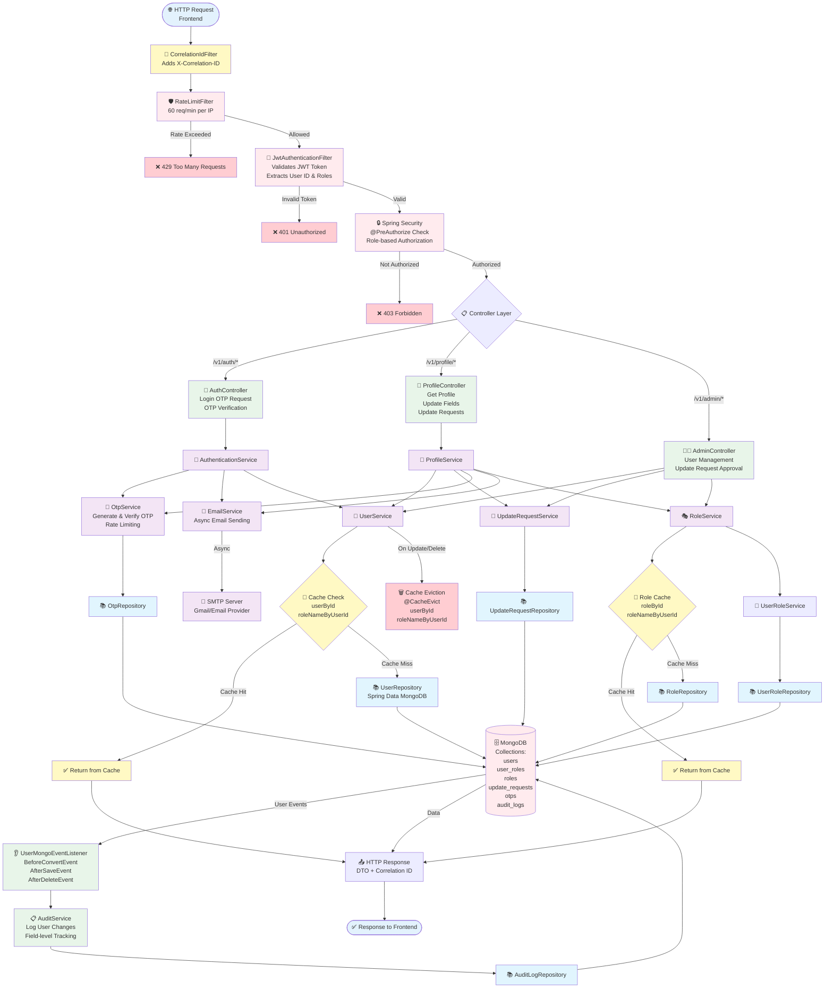

# Complete System Flow Diagram

```mermaid
flowchart TD
    Start([🌐 HTTP Request<br/>Frontend]) --> CorrFilter[📝 CorrelationIdFilter<br/>Adds X-Correlation-ID]
    
    CorrFilter --> RateFilter[🛡️ RateLimitFilter<br/>60 req/min per IP]
    RateFilter -->|Rate Exceeded| RateError[❌ 429 Too Many Requests]
    RateFilter -->|Allowed| JWTFilter[🔐 JwtAuthenticationFilter<br/>Validates JWT Token<br/>Extracts User ID & Roles]
    
    JWTFilter -->|Invalid Token| AuthError[❌ 401 Unauthorized]
    JWTFilter -->|Valid| Security[🔒 Spring Security<br/>@PreAuthorize Check<br/>Role-based Authorization]
    
    Security -->|Not Authorized| AuthzError[❌ 403 Forbidden]
    Security -->|Authorized| Controller{📋 Controller Layer}
    
    Controller -->|/v1/auth/*| AuthCtrl[🔑 AuthController<br/>Login OTP Request<br/>OTP Verification]
    Controller -->|/v1/profile/*| ProfileCtrl[👤 ProfileController<br/>Get Profile<br/>Update Fields<br/>Update Requests]
    Controller -->|/v1/admin/*| AdminCtrl[👨‍💼 AdminController<br/>User Management<br/>Update Request Approval]
    
    AuthCtrl --> AuthSvc[🔐 AuthenticationService]
    ProfileCtrl --> ProfileSvc[👤 ProfileService]
    AdminCtrl --> UserSvc[👥 UserService]
    AdminCtrl --> UpdateReqSvc[📝 UpdateRequestService]
    AdminCtrl --> RoleSvc[🎭 RoleService]
    
    AuthSvc --> OtpSvc[🔢 OtpService<br/>Generate & Verify OTP<br/>Rate Limiting]
    AuthSvc --> EmailSvc[📧 EmailService<br/>Async Email Sending]
    AuthSvc --> UserSvc
    
    ProfileSvc --> UserSvc
    ProfileSvc --> UpdateReqSvc
    ProfileSvc --> OtpSvc
    ProfileSvc --> EmailSvc
    ProfileSvc --> RoleSvc
    
    UserSvc --> CacheCheck{💾 Cache Check<br/>userById<br/>roleNameByUserId}
    CacheCheck -->|Cache Hit| CacheReturn[✅ Return from Cache]
    CacheCheck -->|Cache Miss| UserRepo[📚 UserRepository<br/>Spring Data MongoDB]
    
    RoleSvc --> RoleCache{💾 Role Cache<br/>roleById<br/>roleNameByUserId}
    RoleCache -->|Cache Hit| RoleCacheReturn[✅ Return from Cache]
    RoleCache -->|Cache Miss| RoleRepo[📚 RoleRepository]
    RoleSvc --> UserRoleSvc[🔗 UserRoleService]
    UserRoleSvc --> UserRoleRepo[📚 UserRoleRepository]
    
    UpdateReqSvc --> UpdateReqRepo[📚 UpdateRequestRepository]
    OtpSvc --> OtpRepo[📚 OtpRepository]
    
    UserRepo --> MongoDB[(🗄️ MongoDB<br/>Collections:<br/>users<br/>user_roles<br/>roles<br/>update_requests<br/>otps<br/>audit_logs)]
    RoleRepo --> MongoDB
    UserRoleRepo --> MongoDB
    UpdateReqRepo --> MongoDB
    OtpRepo --> MongoDB
    
    MongoDB -->|User Events| EventListener[👂 UserMongoEventListener<br/>BeforeConvertEvent<br/>AfterSaveEvent<br/>AfterDeleteEvent]
    
    EventListener --> AuditSvc[📋 AuditService<br/>Log User Changes<br/>Field-level Tracking]
    AuditSvc --> AuditRepo[📚 AuditLogRepository]
    AuditRepo --> MongoDB
    
    UserSvc -->|On Update/Delete| CacheEvict[🗑️ Cache Eviction<br/>@CacheEvict<br/>userById<br/>roleNameByUserId]
    
    EmailSvc -->|Async| SMTP[📮 SMTP Server<br/>Gmail/Email Provider]
    
    CacheReturn --> Response[📤 HTTP Response<br/>DTO + Correlation ID]
    RoleCacheReturn --> Response
    MongoDB -->|Data| Response
    
    Response --> End([✅ Response to Frontend])
    
    style Start fill:#e3f2fd
    style End fill:#e3f2fd
    style CorrFilter fill:#fff9c4
    style RateFilter fill:#ffebee
    style JWTFilter fill:#ffebee
    style Security fill:#ffebee
    style AuthCtrl fill:#e8f5e9
    style ProfileCtrl fill:#e8f5e9
    style AdminCtrl fill:#e8f5e9
    style AuthSvc fill:#f3e5f5
    style ProfileSvc fill:#f3e5f5
    style UserSvc fill:#f3e5f5
    style UpdateReqSvc fill:#f3e5f5
    style RoleSvc fill:#f3e5f5
    style OtpSvc fill:#f3e5f5
    style EmailSvc fill:#f3e5f5
    style CacheCheck fill:#fff9c4
    style RoleCache fill:#fff9c4
    style CacheReturn fill:#fff9c4
    style RoleCacheReturn fill:#fff9c4
    style CacheEvict fill:#ffcdd2
    style UserRepo fill:#e1f5fe
    style RoleRepo fill:#e1f5fe
    style UserRoleRepo fill:#e1f5fe
    style UpdateReqRepo fill:#e1f5fe
    style OtpRepo fill:#e1f5fe
    style AuditRepo fill:#e1f5fe
    style MongoDB fill:#ffebee
    style EventListener fill:#e8f5e9
    style AuditSvc fill:#e8f5e9
    style SMTP fill:#f3e5f5
    style RateError fill:#ffcdd2
    style AuthError fill:#ffcdd2
    style AuthzError fill:#ffcdd2
```

